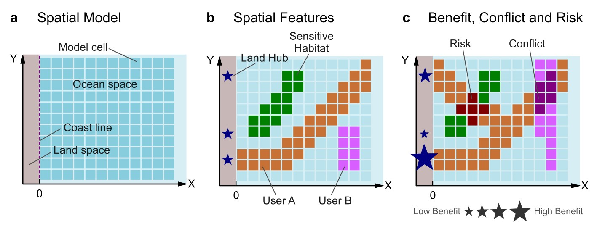

.. _about:

About
############################################

.. toctree::
   :maxdepth: 1

   Home <self>
   about_upg
   about_risk_index
   about_conflict_index
   about_benefit_index

The **PEM Project** (*Planejamento Espacial Marinho do Brasil*, or *Marine Spatial Planning for Brazil*)
is a national initiative aimed at developing **spatially explicit guidelines** for the sustainable and
strategic use of the Brazilian marine environment.

This page provides a conceptual overview of the **general workflow**, which forms the core of
the PEM methodology and underpins all regional plans.

By following this structured and data-driven workflow, the PEM methodology ensures
**reproducibility**, **transparency**, and **scientific robustness** in the
assessment of marine spatial planning outcomes.

All analytical steps are implemented through **R and Python scripts**,
available in this repository, which can be adapted for different regions and data resolutions.

.. seealso::

   For implementation details see the :ref:`User Guide <usage>`

.. _about_workflow:

PEM framework
============================================

The **PEM framework** represents the most abstract and reproducible component of the PEM method.

It begins at a **zero level of information**, where only spatial data are available, and
transforms these datasets into **spatially explicit indicators** and **decision-support maps**.

.. _about_input_data:

Input Data
============================================

At the foundation level, the workflow integrates diverse spatial datasets, including:

* **Bathymetry** – ocean depth and seabed morphology.
* **Habitats** – distribution and characteristics of marine ecosystems.
* **Uses of the ocean** – spatial footprint of human activities across sectors such as fisheries, energy and transportation.
* **Coastal hubs** – ports, cities, and infrastructure nodes that influence or depend on marine uses.

These datasets serve as the basis for constructing higher-level spatial information layers.

.. _about_model:

The Spatial Model
============================================

PEM framework use a spatial model that allows comprehensive decision-making.

This model represents the ocean space and adjacent land as a two-dimensional
surface divided into model cells. Each model cell describes the spatial
unit of analysis, allowing the integration of land,
coastline, and marine environments within the same planning structure.

Within this space, several spatial features are represented: **land hubs** such
as ports, cities, and river mouths; **habitats**, which are sources of ecosystem
services and may be sensitive to disturbance; and **users**, representing the
various sectors that occupy and use ecosystem services. These elements coexist and
interact across the grid, forming the physical and functional components of the
system.

The dynamic interaction among these components gives rise to three key
dimensions of spatial performance: **benefit**, **risk**, and **conflict**.

Benefits flow from users through the use of ecosystem services and connect back
to land hubs. Risks emerge where users overlap with sensitive habitats, and
conflicts arise where different users compete for the same space.

Together, these dimensions define the integrative structure of the PEM framework, which
supports both diagnostic evaluation and scenario-based simulation of marine use
performance.

    Conceptual representation of the spatial model in the PEM framework.
    The ocean and land areas are divided into a spatial grid, where land hubs,
    habitats, and users interact to generate benefit, risk, and conflict metrics
    that support integrated performance assessment and scenario simulation.

.. _about_upg:

Management Units
============================================

An important component of the PEM framework is the creation of
**Management Units**, denoted as UPG — spatial zones that organize
and guide marine management actions.

.. seealso::

   Check out more information about the definition of :ref:`Management Units <about-upg>`

.. _about_indexes:

Integrated Performance Index
============================================

The core integrative indicator of the PEM framework is the **Marine Use Performance Index**,
or **IDUSE-Mar** (*Índice de Desempenho do Uso de Serviços Ecossistêmicos do Mar*).

This index synthesizes the three dimensions — benefit, risk, and
conflict — into a single expression of marine use performance:

.. math::

    D = \frac{B}{R \times C} \quad \text{where } D \in [0, 1]

Where:

* :math:`D` is the **performance** of marine use;
* :math:`B` is the **benefit**;
* :math:`R` is the **risk**; and
* :math:`C` is the **conflict**.

A higher value of :math:`D` indicates a more sustainable and efficient use of
the marine space—high benefits with relatively low risk and conflict.

Spatial Indexes
-------------------------------------------

Through a series of converging analytical processes, the raw data are
transformed into the three key spatial indexes, each representing
a different dimension of marine use performance:

1. **Benefit Index** — quantifies the economic and social **benefit** derived from the use of each spatial unit of the ocean.
2. **Habitat Risk Index** — captures the **environmental fragility** and **sensitivity** of marine habitats exposed to human activities.
3. **Conflict Index** — expresses the **intensity of overlap** or competition between different marine uses within the same area.

Each of these index is calculated as a **relative measure**, allowing
comparisons across spatial scales and scenarios of marine use.

.. seealso::

   Check out more information about the :ref:`Benefit Index <about-benefit-index>`

.. seealso::

   Check out more information about the :ref:`Habitat Risk Index <about-risk-index>`

.. seealso::

   Check out more information about the :ref:`Conflict Index <about-conflict-index>`

Scenario-Based Analyses
============================================

All indices (:math:`B`, :math:`R`, and :math:`C`) are computed for specific **use scenarios**.
Scenarios may represent current conditions, projected developments, or management
alternatives, allowing the **IDUSE-Mar** to serve as a comparative tool
for evaluating policy or spatial planning options.

